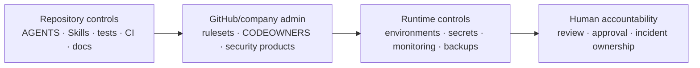

# Enterprise Readiness

This file is the company-readiness checklist for the starter.

It separates what is **implemented in the repository**, what is **configured outside the repository**, and what remains a **production-specific decision**.

A green CI build alone does not mean the system is production-ready.

## Status legend

| Status | Meaning |
|---|---|
| ✅ Repository | Implemented and version-controlled here |
| ⚙️ Admin | Must be configured in GitHub/provider administration |
| 🏗️ Product/infra | Must be decided for the real deployed product |
| 🚫 Blocker | Do not call the project company-production-ready until resolved |

## Readiness matrix

| Area | Status | Required action / evidence |
|---|---|---|
| Application architecture | ✅ Repository | `docs/ARCHITECTURE.md` + ADRs |
| Portable agent rules | ✅ Repository | root/scoped `AGENTS.md` |
| Claude routing/permissions | ✅ Repository | `CLAUDE.md`, `.claude/settings.json` |
| Reusable Skills | ✅ Repository | `.claude/skills/` |
| Specialist AI reviewers | ✅ Repository | `.claude/agents/` |
| Compound Engineering | ✅ Repository | plugin config + CE workflow docs |
| Jira/Figma context policy | ✅ Repository | approved plugins + read-first Skills |
| Deterministic CI | ⚠️ Partial | tests/build exist; lockfile still required |
| `pnpm-lock.yaml` | 🚫 Blocker | generate and commit; change CI to `--frozen-lockfile` |
| Dependency update automation | ✅ Repository | Dependabot config |
| Dependency vulnerability gate | ✅ Repository | dependency-review workflow |
| Code scanning | ⚙️ Admin | enable GitHub CodeQL default setup or approved equivalent |
| Secret scanning | ⚙️ Admin | enable GitHub secret scanning/push protection where available |
| Branch/ruleset enforcement | ⚙️ Admin | protect `main`; repository rulesets currently not verified/enforced by repo files |
| Required human approval | ⚙️ Admin | require PR review/CODEOWNERS in GitHub |
| CODEOWNERS identities | 🚫 Blocker | replace `@your-org/...` placeholders with real teams |
| Claude GitHub review | ⚙️ Admin | configure OAuth/API/WIF if desired |
| Codex managed review | ✅/⚙️ | connector verified; organization controls still apply |
| Environment separation | 🏗️ Product/infra | define dev/staging/prod accounts, URLs, secrets, data policy |
| Production deployment | 🏗️ Product/infra | choose platform and deployment topology |
| Observability | 🏗️ Product/infra | logs, metrics, traces, dashboards, alerts, ownership |
| SLOs | 🏗️ Product/infra | define service objectives and alert thresholds |
| Backup/restore | 🏗️ Product/infra | define RPO/RTO and test restore procedure |
| Release/rollback | ✅ template + 🏗️ | follow `docs/RELEASES.md`; adapt to deployment platform |
| Incident response | ✅ template + 🏗️ | follow `docs/OPERATIONS.md`; set contacts/on-call system |
| Data classification/privacy | ✅ policy + 🏗️ | classify real product data before production |
| Authentication/authorization | 🏗️ Product | starter intentionally does not invent auth requirements |
| Artifact provenance | 🏗️ Release | add attestations when shipping binaries/images/packages |
| License policy | ⚙️ Company | define accepted/restricted dependency licenses |

## Hard blockers before real company production

1. Commit `pnpm-lock.yaml` and use frozen installs in CI.
2. Replace placeholder CODEOWNERS with real people/teams.
3. Verify/enforce protected `main` rules: PR-only, required CI, required human approval, CODEOWNERS, no force push.
4. Enable approved code/secret/dependency security controls.
5. Define dev/staging/prod environment separation and secret ownership.
6. Define production observability, alerting, on-call ownership, backup/restore, and rollback.
7. Complete a product-specific threat model for authentication, authorization, sensitive data, and external integrations.
8. Run a restore/rollback exercise before relying on the service operationally.

## Repository controls vs external controls

Repository files cannot prove that external administrative controls are enabled. The human/platform owner must verify them.

## Review cadence

Review this checklist:

- before first production deployment
- when CI/repository security controls change
- when a new external MCP/plugin is approved
- when architecture or deployment topology changes
- at least once per major release cycle

Do not mark a row complete solely because an AI agent says it is complete. Use concrete configuration/test evidence.
