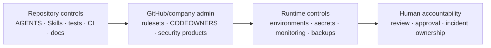

# Enterprise Readiness

This file is the company-readiness checklist for the starter.

It separates what is **implemented in the repository**, what is **configured outside the repository**, and what remains a **production-specific decision**.

A green CI build alone does not mean the system is production-ready.

## Status legend

| Status | Meaning |
|---|---|
| ✅ Repository | Implemented and version-controlled here |
| ⚙️ Admin | Must be configured in GitHub/provider administration |
| 🏗️ Product/infra | Must be decided for the real deployed product |
| 🚫 Blocker | Do not call the project company-production-ready until resolved |

## Readiness matrix

| Area | Status | Required action / evidence |
|---|---|---|
| Application architecture | ✅ Repository | `docs/ARCHITECTURE.md` + ADRs |
| Portable agent rules | ✅ Repository | root/scoped `AGENTS.md` |
| Claude routing/permissions | ✅ Repository | `CLAUDE.md`, `.claude/settings.json` |
| Reusable Skills | ✅ Repository | `.claude/skills/` |
| Specialist AI reviewers | ✅ Repository | `.claude/agents/` |
| Compound Engineering | ✅ Repository | plugin config + CE workflow docs |
| Jira/Figma context policy | ✅ Repository | approved plugins + read-first Skills |
| Deterministic CI | ✅ Repository | committed `pnpm-lock.yaml`, frozen install, pnpm cache, lint/test/build/e2e |
| Dependency update automation | ✅ Repository | Dependabot config |
| Dependency vulnerability gate | ✅ Repository | dependency-review workflow |
| Architecture documentation | ✅ Repository | diagrams + ADR policy + architecture reviewer |
| Testing strategy | ✅ Repository | `docs/TESTING.md` + CI evidence |
| Security/trust model | ✅ Repository | `docs/SECURITY_MODEL.md` + security reviewer |
| Environment policy | ✅ Repository | `docs/ENVIRONMENTS.md` template/policy |
| Release/rollback policy | ✅ Repository | `docs/RELEASES.md` + release-readiness Skill |
| Operations/incident policy | ✅ Repository | `docs/OPERATIONS.md` + incident-assist Skill |
| Code scanning | ⚙️ Admin | enable GitHub CodeQL default setup or approved equivalent |
| Secret scanning | ⚙️ Admin | enable GitHub secret scanning/push protection where available |
| Branch/ruleset enforcement | ⚙️ Admin | protect `main`; effective protection is not verified by repository files |
| Required human approval | ⚙️ Admin | require PR review/CODEOWNERS in GitHub |
| CODEOWNERS identities | 🚫 Blocker | replace `@your-org/...` placeholders with real teams |
| Claude GitHub review | ⚙️ Admin | configure OAuth/API/WIF if desired |
| Codex managed review | ✅/⚙️ | connector verified; organization controls still apply |
| Real environment separation | 🏗️ Product/infra | fill actual dev/staging/prod accounts, URLs, secrets, data policy |
| Production deployment | 🏗️ Product/infra | choose platform and deployment topology |
| Observability | 🏗️ Product/infra | logs, metrics, traces, dashboards, alerts, ownership |
| SLOs | 🏗️ Product/infra | define service objectives and alert thresholds |
| Backup/restore | 🏗️ Product/infra | define RPO/RTO and test restore procedure |
| Data classification/privacy | ✅ policy + 🏗️ | classify real product data before production |
| Authentication/authorization | 🏗️ Product | starter intentionally does not invent auth requirements |
| Artifact provenance | 🏗️ Release | add/verify attestations when shipping binaries/images/packages |
| License policy | ⚙️ Company | define accepted/restricted dependency licenses |

## Hard blockers before real company production

1. Replace placeholder CODEOWNERS with real people/teams.
2. Verify/enforce protected `main` rules: PR-only, required CI, required human approval, CODEOWNERS, no force push.
3. Enable the company's approved code-scanning and secret-scanning/push-protection controls.
4. Define actual dev/staging/prod environment separation, secret ownership, and production access model.
5. Define production observability, alerting/SLOs, on-call ownership, backup/restore, and deployment/rollback implementation.
6. Complete a product-specific threat model for authentication, authorization, sensitive data, tenant boundaries, payments, or other high-risk features actually introduced.
7. Run a restore/rollback exercise before relying on the service operationally.
8. Replace all remaining operational placeholders (owners, URLs/accounts, systems) with real company configuration before production.

## Repository controls vs external controls

Repository files cannot prove that external administrative controls are enabled. The human/platform owner must verify them.

## Evidence rule

Mark an item complete only from concrete evidence, for example:

- repository file/CI result for repository controls
- GitHub/admin screenshot or settings/API evidence for platform controls
- deployment/runbook/test evidence for production controls
- named human ownership for accountable decisions

Do not mark a row complete solely because an AI agent says it is complete.

## Review cadence

Review this checklist:

- before first production deployment
- when CI/repository security controls change
- when a new external MCP/plugin is approved
- when architecture or deployment topology changes
- after a meaningful incident that exposes a control gap
- at least once per major release cycle
