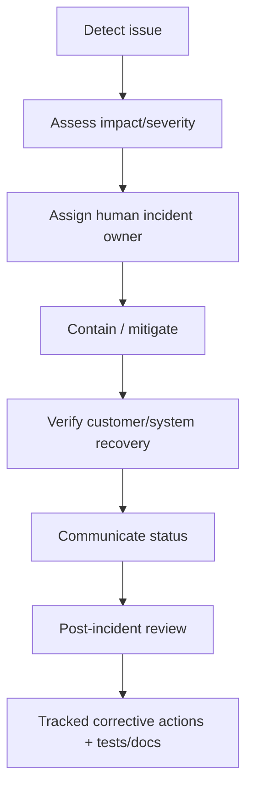

# Operations and Incident Runbook

This is the minimum operational contract for turning the starter into a real service.

The actual monitoring vendor, deployment platform, pager system, and backup system are company-specific and must be filled in before production.

## Service ownership

Before production, define:

```text
Service owner:      <team/person>
Technical owner:    <team/person>
On-call channel:    <system/channel>
Security contact:   <private channel>
Runbook owner:      <team/person>
```

Do not leave these placeholders unresolved for a production service.

## Health model

Current starter endpoint:

```text
GET /api/health
```

A health endpoint should answer only what automation needs. Do not expose credentials, internal stack traces, customer data, or unnecessary topology.

As the system grows, distinguish:

- liveness: process can continue running
- readiness: process can serve traffic safely
- dependency health: database/downstream state, used carefully to avoid cascading failures

## Observability baseline

Production services should have structured, searchable telemetry for:

### Logs

- request/correlation ID
- service/environment/version
- timestamp
- severity
- safe error category

Never log passwords, tokens, secrets, session material, or unnecessary personal data.

### Metrics

At minimum consider:

- request rate
- error rate
- latency percentiles
- saturation/resource pressure
- DB connection/query health
- queue/background job metrics when added

### Traces

Use distributed tracing when multiple services/downstream dependencies make request diagnosis difficult. Propagate correlation context across boundaries.

## SLOs and alerting

Do not invent meaningless alert thresholds in the starter.

Before production, define product-specific:

- availability objective
- latency objective
- error budget
- paging thresholds
- business-critical synthetic checks

Alerts must have an owner and an action. Avoid alerts that nobody knows how to respond to.

## Incident flow



### AI role during incidents

AI may:

- summarize logs/context supplied to it
- search approved documentation
- propose hypotheses
- draft commands or remediation plans
- prepare a patch for review

AI must not autonomously:

- execute destructive production operations
- rotate/reveal secrets
- disable security controls
- delete production data
- declare the incident resolved

A human incident owner remains accountable.

## Incident severity template

Adapt to company policy:

| Severity | Example impact | Expected handling |
|---|---|---|
| SEV-1 | broad outage, severe security/data impact | immediate incident leadership + executive/security escalation |
| SEV-2 | major degraded functionality | urgent owner + coordinated response |
| SEV-3 | limited degradation/workaround exists | normal on-call/team response |
| SEV-4 | minor operational defect | backlog/normal prioritization |

The company may use different names/numbers; consistency matters more than this exact table.

## Backup and restore

Before production define:

- what is backed up
- backup frequency/retention
- encryption/access ownership
- RPO (acceptable data loss window)
- RTO (acceptable recovery time)
- restore procedure
- last successful restore test date

A backup that has never been restored in a test is not strong recovery evidence.

## Common operational checks

### API not responding

1. check deployment/process health
2. check `/api/health`
3. inspect recent error-rate/latency changes
4. inspect database connectivity/resources
5. correlate with recent deployments/migrations/config changes
6. mitigate using the safest release/rollback option

### Database errors

1. determine connectivity vs capacity vs query/schema issue
2. do not run destructive SQL as a first response
3. identify recent migration/release
4. involve database/service owner
5. verify backup/restore state before destructive repair

### Bad deployment

Follow `docs/RELEASES.md` and use the documented rollback/forward-fix path.

## Post-incident learning

A meaningful incident should result in some combination of:

- regression test
- monitoring/alert improvement
- runbook update
- architecture/ADR update
- `docs/solutions/` entry
- ownership/process correction

Do not use AI-generated postmortems to assign blame. Focus on system/process causes and verifiable corrective actions.
