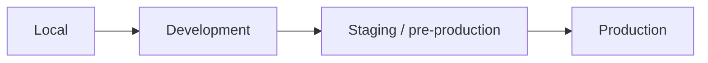

# Release and Rollback Policy

This starter does not prescribe a production hosting platform, but it does prescribe the controls around a release.

## Release principle

A merge is not automatically a production release unless the company's deployment system explicitly defines it that way.

AI may prepare release evidence. An authorized human/service owner owns production release decisions.

## Environment flow

Recommended default:



Do not reuse production credentials or customer datasets in lower environments.

## Release gate

Before production promotion, confirm:

- approved PR(s) are merged
- required CI/security checks passed on the exact release commit
- database migrations were reviewed
- backward compatibility was considered
- configuration/secrets exist in the target environment
- observability/alerts cover the changed critical path
- rollback or forward-fix path is understood
- release owner is identified
- high-risk changes have required domain/security approval

## Database migration strategy

Prefer backwards-compatible expand/contract changes.

Example:

```text
Release A: add new nullable column/table/index
   ↓
Release B: code reads/writes old + new safely
   ↓
Backfill/verify if needed
   ↓
Release C: remove obsolete path after compatibility window
```

Avoid combining an irreversible destructive migration with code that requires it immediately unless the rollout plan explicitly handles failure.

Before a destructive migration, document:

- affected data
- backup/restore capability
- expected lock/runtime impact
- rollback feasibility
- owner and maintenance window if needed

## Rollback hierarchy

Prefer the safest applicable option:

1. disable feature with a feature/config switch, when available
2. roll application artifact back to last known-good release
3. forward-fix with a small reviewed patch
4. data/schema repair only with explicit database owner approval

Never tell an AI agent to improvise a destructive production rollback.

## Release evidence

For each production release, retain:

- release commit/tag/version
- linked PRs/tickets
- CI/security status
- migration list
- deployment time + owner
- verification evidence
- rollback target/procedure
- notable incidents or follow-up actions

## Hotfix

A hotfix may shorten normal planning, but it must not bypass:

- human review
- relevant automated tests
- security review for security-sensitive changes
- post-release verification

After emergency stabilization, capture the root cause/regression test and update `docs/solutions/` or the incident record.

## Artifact provenance

When the real project starts shipping container images, binaries, packages, or downloadable artifacts, add build provenance/attestation appropriate to the deployment platform. Do not add attestation only as decoration; the consuming/deployment side must verify it for the control to provide value.
