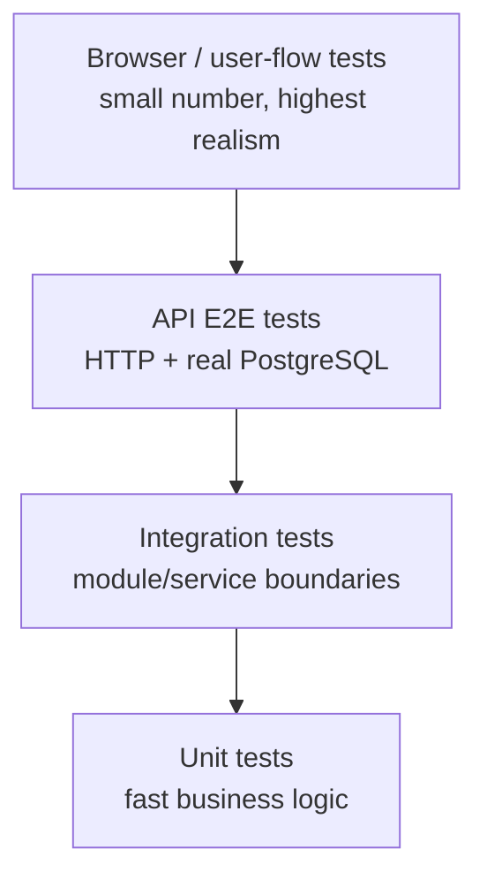

# Testing Strategy

The goal of testing is confidence in behavior, not maximizing a vanity coverage number.

## Test pyramid for this repository



Use the cheapest test that reliably proves the behavior.

## Required levels

### Unit

Use for:

- business rules
- validation helpers
- query/serialization logic
- important frontend utilities/hooks

Unit tests should not mock so deeply that they merely assert implementation details.

### API E2E

Use Nest e2e tests with a real disposable PostgreSQL database for important HTTP contracts:

- status codes
- validation failures
- persistence
- filters/pagination
- not-found behavior
- auth/authz when introduced

Database-backed e2e tests run serially unless each worker receives an isolated database/schema.

### Frontend behavior

Test logic that is easy to regress and difficult to prove by typechecking alone.

For significant user-facing flows, browser verification should cover the changed behavior. When browser automation becomes a permanent product requirement, add a committed Playwright suite rather than relying only on an agent's interactive browser session.

## Regression rule

Every confirmed defect should answer:

> What automated test would have caught this before merge?

Add that regression test when practical.

## Test data

- Never use production customer data in tests.
- Use deterministic fixtures/factories.
- Keep timestamps/time zones explicit when behavior depends on them.
- Clean or isolate database state between test cases.
- Do not make external production API calls from CI tests.

## Flaky tests

Do not solve flakiness by silently retrying forever or skipping the test.

When a test is flaky:

1. identify the nondeterministic dependency
2. fix isolation/timing/data ownership
3. quarantine only if necessary and with a tracked owner/ticket
4. keep the missing gate visible until repaired

## Coverage

No global percentage is mandated by this starter because useful thresholds depend on the real product.

Coverage expectations are risk-based:

- money/auth/security/data-integrity logic requires strong direct tests
- changed business rules require happy + failure paths
- migrations require compatibility/rollback reasoning
- trivial presentational glue does not need artificial tests solely to increase a percentage

If the company adopts a numeric coverage policy, enforce it in CI and document the rationale here.

## Verification before PR handoff

From repository root:

```bash
pnpm lint
pnpm test
pnpm build
pnpm test:e2e
```

For user-facing work also record browser evidence when applicable.

The PR must state what was actually run. Do not check boxes for commands that were not executed.
